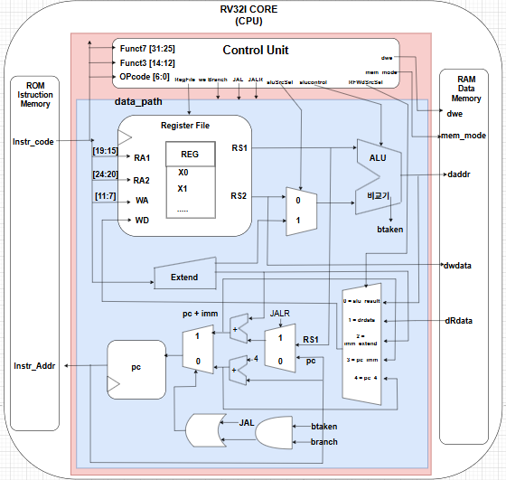

# RV32I Single-Cycle CPU

SystemVerilog로 구현한 **32-bit RISC-V Single-Cycle CPU**입니다. 명령어 Fetch부터 Decode, Execute, Memory Access, Write Back까지의 데이터 흐름을 직접 설계하고 Vivado Simulation으로 검증했습니다.

> 개인 프로젝트 · 2026.05.19 - 2026.05.27 · SystemVerilog · Xilinx Vivado

## Architecture



최상위 SoC는 CPU Core, Instruction Memory, Data Memory로 구성됩니다. CPU 내부는 Control Unit과 Datapath로 분리했으며 Datapath에 Program Counter, Register File, ALU, Immediate Extend, Write-Back MUX를 배치했습니다.

## Implemented Features

- 32-bit instruction, register, ALU 및 memory datapath
- `opcode`, `funct3`, `funct7` 기반 combinational instruction decoder
- x0 hard-wired zero 처리와 2-read/1-write Register File
- I/S/B/U/J-Type별 Immediate 생성 및 sign extension
- `PC+4`, Branch, JAL, JALR 기반 next-PC 선택
- Byte/Halfword/Word Load·Store와 sign/zero extension
- Bubble Sort C 코드와 103-word instruction memory image
- Vivado waveform 기반 instruction 및 프로그램 흐름 분석

## Instruction Support

제출 RTL을 기준으로 RV32I 기본 명령어 40개 중 아래 **37개**를 구현했습니다.

| Group | Instructions |
|---|---|
| Register ALU | `ADD SUB SLL SLT SLTU XOR SRL SRA OR AND` |
| Immediate ALU | `ADDI SLTI SLTIU XORI ORI ANDI SLLI SRLI SRAI` |
| Load | `LB LH LW LBU LHU` |
| Store | `SB SH SW` |
| Branch | `BEQ BNE BLT BGE BLTU BGEU` |
| Upper Immediate | `LUI AUIPC` |
| Jump | `JAL JALR` |

`FENCE`, `ECALL`, `EBREAK`은 포함하지 않습니다.

## My Work

개인 프로젝트로 다음 항목을 직접 설계하고 분석했습니다.

- CPU top, Control Unit 및 전체 Datapath 통합
- ALU와 signed/unsigned Branch 비교 로직
- Register File, Immediate Extend, Program Counter 및 Write-Back MUX
- Byte/Halfword/Word Data Memory 접근과 sign/zero extension
- R/I/S/B/U/J-Type instruction decode 및 control signal 생성
- Testbench 작성, waveform 분석 및 Bubble Sort 프로그램 흐름 검증

## Source Structure

| Path | Description |
|---|---|
| `rtl/top_rv32i_soc.sv` | CPU, Instruction ROM, Data RAM 통합 |
| `rtl/rv32i_cpu.sv` | Control Unit과 Datapath 연결 |
| `rtl/control_unit.sv` | Instruction decode 및 control signal 생성 |
| `rtl/rv32i_datapath.sv` | PC, Register File, ALU, Immediate, MUX |
| `rtl/instruction_mem.sv` | 기본 instruction smoke-test ROM |
| `rtl/data_mem.sv` | Load/Store 및 sign/zero extension |
| `rtl/define.vh` | Opcode, ALU, memory mode 정의 |
| `tb/tb_rv32i.sv` | Clock/reset 기반 top-level simulation |
| `program/bubble_sort.c` | 제출된 Bubble Sort C source |
| `program/instruction_mem_sort.mem` | 제출된 103-word RISC-V memory image |

원본의 `type.vh`는 `define.vh`와 동일한 중복 파일이어서 공개 구조에서는 제외했습니다.

## Verification Summary

- R/I/S/Load/B/U/J/JALR Type별 decode, ALU, Write Back 흐름 확인
- `LB/LH` sign extension 및 `LBU/LHU` zero extension 확인
- Branch의 `b_taken`, target address, `PC+4` 선택 흐름 확인
- JAL/JALR 함수 호출·복귀와 Return Address 저장 흐름 분석
- Bubble Sort 파형에서 Stack Frame, 배열 Load/Store, Branch, swap 호출을 추적
- 보고서 기준 Single-Cycle critical path에서 negative slack을 확인하고 Multi-Cycle/Pipeline 구조를 개선 방향으로 도출

## Reproduction Notes and Limitations

이 저장소는 제출 소스의 동작과 한계를 그대로 보존한 포트폴리오 스냅샷입니다.

- 현재 `rtl/instruction_mem.sv`는 LUI/AUIPC smoke-test 명령을 직접 초기화하며 `instruction_mem_sort.mem`을 `$readmemh`로 불러오지 않습니다.
- Register File은 x1=1, x2=2로 초기화되지만 보고서의 Bubble Sort 분석은 Stack Pointer x2=256을 전제로 합니다. 따라서 제출 파일만 실행하면 보고서의 Bubble Sort 파형이 자동 재현되지는 않습니다.
- `bubble_sort.c`는 `int Num[6] = {3,5,9,1,7}`과 `j < size - i` 조건을 사용하여 여섯 번째 초기값 `0`까지 비교합니다. 실제 캡처 파형에도 `0,1,3,5,7,9`가 나타납니다. 다섯 값만 정렬하려면 배열 길이와 `size`를 일치시키고 내부 조건을 `j < size - i - 1`로 수정한 뒤 memory image를 다시 생성해야 합니다.
- Testbench는 1100 cycle 실행용으로 작성되어 있으며 assertion이나 자동 PASS/FAIL 판정은 없습니다. 검증 결과는 Vivado waveform 수동 분석을 기준으로 합니다.
- FPGA 보드 구현, XDC, Pipeline, Cache, Interrupt, CSR 및 privileged architecture는 범위에 포함하지 않았습니다.

## Project Layout

```text
fpga-rv32i-single-cycle/
├── assets/
│   └── architecture.png
├── rtl/
│   ├── control_unit.sv
│   ├── data_mem.sv
│   ├── define.vh
│   ├── instruction_mem.sv
│   ├── rv32i_cpu.sv
│   ├── rv32i_datapath.sv
│   └── top_rv32i_soc.sv
├── tb/
│   └── tb_rv32i.sv
├── program/
│   ├── bubble_sort.c
│   └── instruction_mem_sort.mem
├── .gitignore
└── README.md
```
