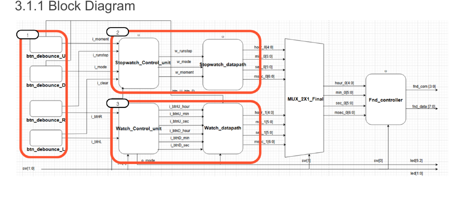

# FPGA Stopwatch & Watch

Digilent Basys3 FPGA에서 동작하는 **디지털 시계(Watch)와 스톱워치(Stopwatch) 통합 시스템**입니다. Verilog RTL로 Control Unit과 Datapath를 분리하고, 버튼 입력부터 시간 카운트 및 4자리 7-Segment 표시까지 하나의 시스템으로 구현했습니다.

> 2인 팀 프로젝트 · 2026.04.16 - 2026.04.20



## 담당 역할

- Stopwatch FSM 기반 Control Unit 설계
- 100 Hz Tick Generator와 `msec → sec → min → hour` Cascade Counter Datapath 구현
- RUN / STOP / CLEAR / UP·DOWN MODE 제어
- 현재 시간을 별도 레지스터에 저장하는 Moment Capture / Hold 기능 구현
- Stopwatch 시뮬레이션 시나리오 구성 및 Basys3 FPGA 동작 검증

## 핵심 기능

### Stopwatch Mode (`sw[1] = 0`)

- `btnR`: RUN / STOP 전환
- `btnL`: CLEAR
- `btnD`: UP / DOWN Count Mode 전환
- `btnU`: Moment Capture / Hold 전환

Moment 기능은 내부 카운터를 멈추지 않고 특정 시점의 값만 별도 레지스터에 저장해 표시합니다. Hold를 해제하면 계속 흐르던 실시간 값으로 복귀합니다.

### Watch Mode (`sw[1] = 1`)

- NORMAL / HOUR / MIN / SEC 상태를 갖는 FSM
- `btnL`, `btnR`: 시간 설정 대상 선택
- `btnU`, `btnD`: 선택된 시간 값 증가·감소
- 현재 설정 상태를 LED로 표시

### Display & Input

- Basys3 100 MHz 시스템 클록을 100 Hz 시간 Tick으로 분주
- `sw[0] = 0`: `sec / msec` 표시
- `sw[0] = 1`: `hour / min` 표시
- 1 kHz 기반 4-Digit 7-Segment Dynamic Multiplexing
- 8-sample Shift Register와 Edge Detector 기반 Button Debounce

## 설계 구조

| 블록 | 역할 |
|---|---|
| `button_debounce` | 물리 버튼 채터링 제거 및 1-Clock Pulse 생성 |
| `control_unit` | Stopwatch의 STOP, RUN, CLEAR, MODE, MOMENT FSM |
| `stopwatch_datapath` | Tick 생성, Cascade Counter, Moment Register |
| `watch_control_unit` | Watch 설정 상태 FSM |
| `watch_datapath` | Watch 시간 누적 및 수동 시간 조정 |
| `mux_2x1_final` | Stopwatch / Watch 시간 데이터 선택 |
| `fnd_controller` | 자릿수 분리, BCD 변환, FND Multiplexing |
| `toptop` | 전체 시스템 통합 Top Module |

## 검증 내용

- Reset 이후 Stopwatch RUN 진입과 100 Hz 기반 시간 증가
- STOP 상태에서 CLEAR 및 Count Mode 변경
- Moment Capture, Hold 및 실시간 출력 복귀
- Watch Mode 전환과 HOUR / MIN / SEC 값 조정
- 7-Segment 출력 값과 자리 선택 신호 확인
- Vivado Simulation 후 Basys3 보드에서 실제 동작 확인

## Troubleshooting

- Tick과 시간 조정 버튼이 동시에 입력될 때 증가량이 누락되는 조건을 분리해 처리
- 모듈과 Wire 증가로 신호 흐름이 복잡해진 문제를 Block Diagram과 I/O 정의로 재구성
- 버튼 채터링으로 발생하는 중복 입력을 Debounce와 Edge Detection으로 안정화

## 프로젝트 구조

```text
fpga-stopwatch-watch/
├── README.md
├── assets/
│   └── architecture.png
├── constraints/
│   └── Basys-3-Master.xdc
├── src/
│   ├── button_debounce.v
│   ├── control_unit.v
│   ├── fnd_controller.v
│   ├── stopwatch_datapath.v
│   ├── top_stopwatch_watch.v
│   ├── toptop.v
│   ├── watch.v
│   ├── watch_control_unit.v
│   └── watch_datapath.v
└── tb/
    └── tb_watch.v
```

## Vivado 실행 방법

1. Vivado에서 RTL Project를 생성하고 Target Board를 Basys3로 선택합니다.
2. `src/*.v`를 Design Sources에 추가합니다.
3. `constraints/Basys-3-Master.xdc`를 Constraints에 추가합니다.
4. `toptop`을 Top Module로 지정합니다.
5. 시뮬레이션 시 `tb/tb_watch.v`를 Simulation Sources에 추가합니다.
6. Synthesis, Implementation, Bitstream Generation 후 Basys3에 Program합니다.

> 제출본의 RTL 동작은 유지했으며, 포트폴리오 정리 과정에서 Testbench 출력 폭과 사용하지 않는 `sw[2]` Constraint만 Top Module 인터페이스에 맞게 정리했습니다.
