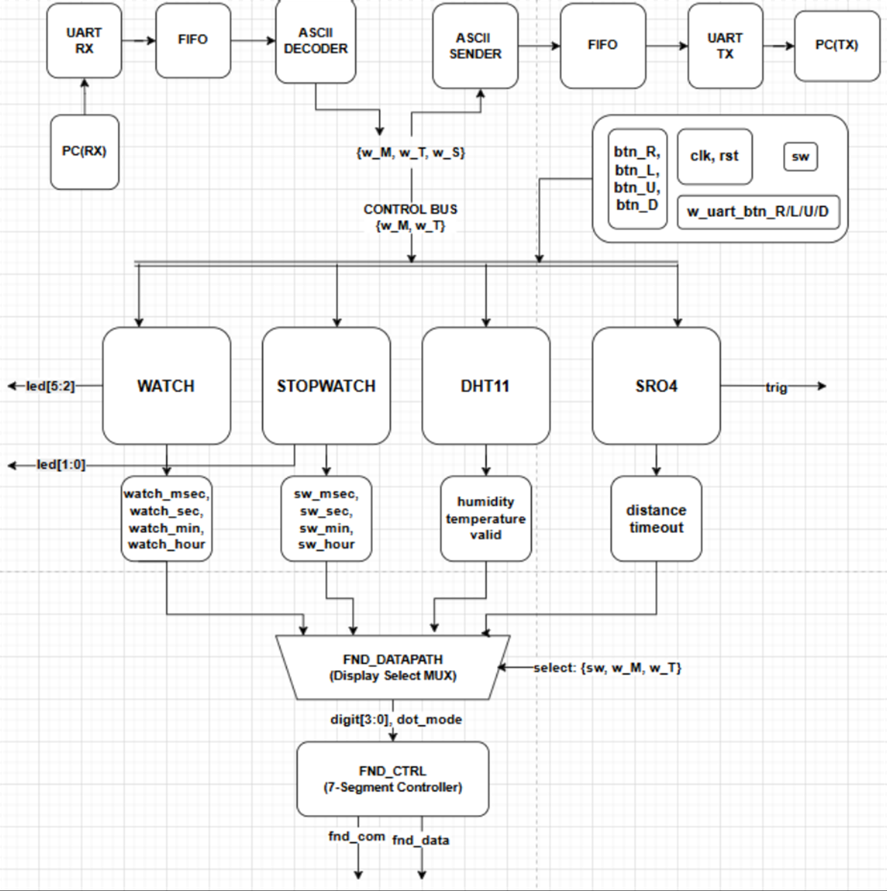

# FPGA UART/FIFO Sensor Control System

Digilent Basys3 FPGA에서 **Stopwatch, Watch, DHT11, HC-SR04, UART/FIFO 통신과 4-Digit 7-Segment 출력**을 하나의 Verilog RTL 시스템으로 통합한 프로젝트입니다.

> 3인 팀 프로젝트 · 2026.05.01 - 2026.05.06 · Xilinx Vivado · 100 MHz

## System Architecture



PC에서 전달한 ASCII 명령은 `UART RX -> FIFO -> ASCII Decoder` 경로를 거쳐 모드와 버튼 제어 신호로 변환됩니다. 각 기능 블록의 결과는 공용 FND Datapath와 `ASCII Sender -> FIFO -> UART TX` 경로로 전달됩니다.

## Key Features

- Stopwatch: Run/Stop, Clear, Up/Down, Moment Capture/Hold
- Watch: 시·분·초 표시 및 개별 증가/감소
- DHT11: 단일 데이터선 기반 40-bit 온습도 수신과 checksum 검증
- HC-SR04: Echo pulse-width 기반 거리 계산과 30 ms timeout 처리
- UART/FIFO: 9600 bps ASCII 명령 입력 및 시간·센서 데이터 송신
- Display: 모드별 데이터를 하나의 4-Digit 7-Segment에 동적 멀티플렉싱
- Input: 물리 버튼과 UART 명령을 동일한 내부 제어 신호로 통합

## Operating Modes

| Mode | Function | Main output |
|---|---|---|
| `00` | Stopwatch | msec / sec / min / hour |
| `01` | Watch | sec / min / hour |
| `10` | DHT11 | humidity / temperature / valid |
| `11` | HC-SR04 | distance / timeout |

주요 UART 명령은 `R/L/U/D`(버튼 동작), `M`(모드 전환), `T`(출력 선택), `S`(선택 데이터 송신)입니다.

## My Contributions

- DHT11 Controller의 FSM, 1 us timing, 40-bit 데이터 수신 및 checksum 검증 설계
- DHT11 단위 테스트와 최종 `top_4module` 통합 테스트벤치 작성
- 공용 FND 출력 및 센서 Control 통합 작업 참여
- Simulation waveform과 Basys3 보드에서 온습도 모드 및 통합 동작 검증

## RTL Structure

| Path | Description |
|---|---|
| `src/top_4module.v` | Watch, Stopwatch, Sensor, UART/FIFO 최상위 통합 |
| `src/dht11.v` | DHT11 single-wire controller 및 checksum |
| `src/TOP_sr04_controller.v` | HC-SR04 trigger/echo, 거리 계산, timeout |
| `src/top_stopwatch_watch.v` | Stopwatch FSM, Datapath, Moment |
| `src/watch.v` | Watch FSM 및 시간 Datapath |
| `src/fnd_ctrl_final.v` | 모드 선택, BCD 변환, 7-Segment multiplexing |
| `src/uart/ascii_decoder.v` | PC ASCII 명령 디코딩 |
| `src/uart/ascii_sender_data.v` | 시간·센서 데이터의 ASCII 직렬화 |
| `src/uart/uart_fifo_whole.v` | UART/FIFO/Decoder/Sender 통합 wrapper |
| `tb/` | 센서, ASCII, UART/FIFO 및 전체 통합 testbench |

## Verification and Troubleshooting

- DHT11: `IDLE -> START -> WAIT -> SYNCL/SYNCH -> DATA` 흐름과 40-bit 수신, checksum `valid` 확인
- HC-SR04: Echo 미수신 시 WAIT 상태에 고정되는 문제를 발견하고 30 ms timeout 후 IDLE 복귀 경로 추가
- UART: `RX -> FIFO -> Decoder -> Sender -> FIFO -> TX` 데이터 흐름과 UART frame 확인
- Top integration: UART 명령에 따른 네 가지 모드 전환과 FND/센서 데이터 선택 검증

## Known Limitations

- 제출 소스 묶음에는 `uart_fifo` 하위 구현과 Basys3 XDC가 포함되어 있지 않습니다. 따라서 이 저장소만으로 전체 시스템을 독립 합성하려면 원본 Vivado 프로젝트의 UART/FIFO RTL과 제약 파일이 추가로 필요합니다.
- 연속된 `S` 명령에서는 Sender timing이 겹칠 수 있고, 장시간 반복 입력에서는 FIFO pop-valid 제어 부족으로 의도치 않은 재출력이 발생할 수 있습니다. 개선 방향은 RX pop 시점의 `valid` 생성과 TX `busy/ready` handshake 추가입니다.
- 공개 자료는 제출 ZIP의 RTL과 테스트벤치를 보존한 포트폴리오 스냅샷이며, 기능 RTL은 임의로 수정하지 않았습니다.

## Project Layout

```text
fpga-uart-fifo-sensor-system/
├── assets/
│   └── system-architecture.png
├── src/
│   ├── uart/
│   └── *.v
├── tb/
│   └── tb_*.v
├── .gitignore
└── README.md
```
